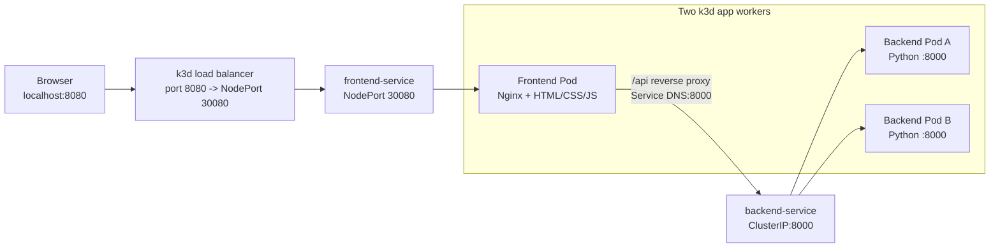
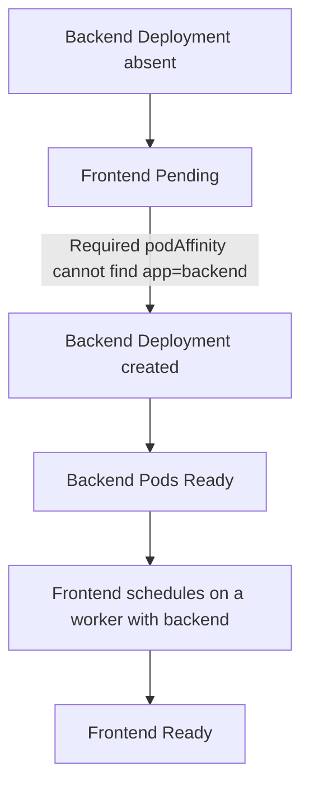

# Mini Shop architecture

```mermaid
flowchart LR
    browser["Browser\nlocalhost:8080"] --> port["k3d load balancer\nport 8080 -> NodePort 30080"]
    port --> frontSvc["frontend-service\nNodePort 30080"]
    frontSvc --> frontend["Frontend Pod\nNginx + HTML/CSS/JS"]
    frontend -->|"/api reverse proxy\nService DNS:8000"| backSvc["backend-service\nClusterIP:8000"]
    backSvc --> backendA["Backend Pod A\nPython :8000"]
    backSvc --> backendB["Backend Pod B\nPython :8000"]
    subgraph workers["Two k3d app workers"]
      backendA
      backendB
      frontend
    end
```

```mermaid
flowchart TD
    backendMissing["Backend Deployment absent"] --> frontendPending["Frontend Pending"]
    frontendPending -->|"Required podAffinity cannot find app=backend"| backendCreated["Backend Deployment created"]
    backendCreated --> backendReady["Backend Pods Ready"]
    backendReady --> frontendScheduled["Frontend schedules on a worker with backend"]
    frontendScheduled --> frontendReady["Frontend Ready"]
```
